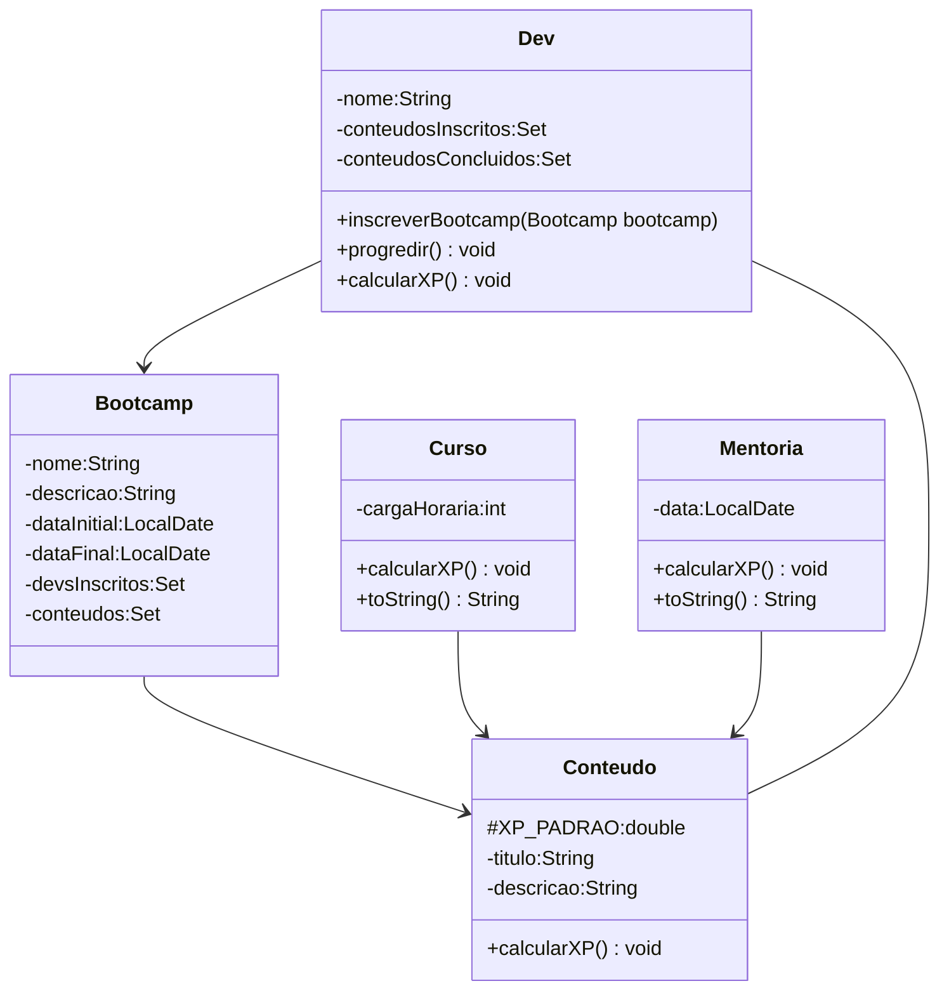

# io-trilha-java-Bootcamp-Usando-Orienta-Objetos-em-Java
Desafio de código ofertado pela DIO- Abstraindo um Bootcamp Usando Orientação a Objetos em Java

## Diagrama UML (Mermaid)

## Referencia
[https://github.com/cami-la/desafio-poo-dio](Github do desafio)
[https://mermaid.js.org/intro/](Mermaid Docs)
